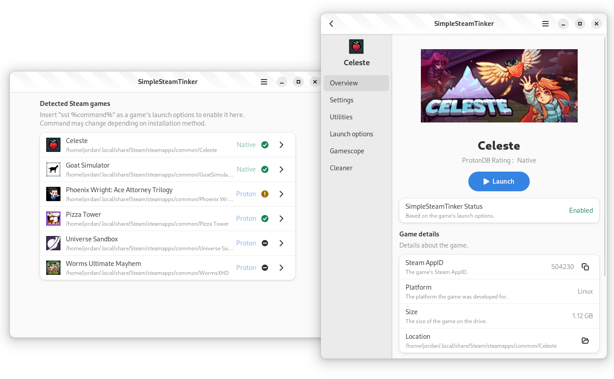

> [!IMPORTANT]
> SimpleSteamTinker is still in ***HEAVY*** development and very unfinished.
> Expect an incomplete interface and lots of missing/unstable features.
>
> If SteamTinkerLaunch is fast enough for you and fits your needs, you should not use this tool right now.
>
> With that being said, I'd still very much appreciate people testing SimpleSteamTinker and reporting [issues](https://github.com/JordanViknar/SimpleSteamTinker/issues) or contributing.

	
	<h1>SimpleSteamTinker</h1>
	
A work-in-progress simple, fast, and modern Adwaita alternative to SteamTinkerLaunch.

	<!-- Badges -->
	
	 
	
	
	
	 
	<!-- Screenshot -->
	

## Description

### Rant

I like SteamTinkerLaunch, I like it a lot. In fact, I consider it to be one of the most important tools for Linux gaming.

However, it has always been flawed to me : it is *slow*, it is difficult to use, and the user interface is very messy.

I want Linux Gaming to be for **everyone**. SteamTinkerLaunch, as a tool, ***fails*** to make itself easily usable by non-technical users.

The straw that broke the camel's back was when my curiosity got me to look inside its source code, only to be met with a single Bash script containing 26 000 lines.

So, not only is it slow, not only is it not user-friendly, but it's not even developer-friendly. It's time to fix that.

### Goal

*TL;DR : Simple, Fast, Modern & User-Friendly*

SimpleSteamTinker aims right now to be only an alternative to SteamTinkerLaunch, not to replace it : I do not intend to implement the more complex features of it that the average user won't need.

Using Lua, a fast and simple language, and Adwaita, a modern user-friendly interface system, the goal of this project is to have a clean and easy but *powerful* way of launching Steam games with custom options and tools.

It takes inspiration from [Bottles](https://github.com/bottlesdevs/Bottles) and Adwaita applications in general.

Additionally, I consider SimpleSteamTinker should work *with* Steam rather than hack/replace its features. Anything that can be easily done on the Steam side of things will not be implemented (Proton version management for example. If you want to use Proton-GE, I'd recommend [ProtonPlus](https://github.com/Vysp3r/ProtonPlus) or [ProtonUp-Qt](https://github.com/DavidoTek/ProtonUp-Qt)).

And finally, as a side goal : prove that Lua can *also* be used for developing modern applications, just like for example Python (which I often see in Adwaita apps).

## Installation

### Local

### Arch Linux-based distributions

<!-- To be finished -->

## Development

## Comparison

| Development | SteamTinkerLaunch | SimpleSteamTinker |
| --- | --- | --- |
| Language | Bash | Lua |
| Code | 26k lines in one file | Neatly organised in modules and commented |
| UI | Mashed into the code | (Mostly) defined in separate Blueprint files |
| License | GPL-3.0 | MPL-2.0 |

| Feature | SteamTinkerLaunch | SimpleSteamTinker |
| --- | --- | --- |
| Speed | *Oof...* | *Woosh !* |
<!-- To be finished -->

## Bug Reports / Contributions / Suggestions
You can report bugs or suggest features by making an issue, or you can contribute to this program directly by forking it and then sending a pull request.

Any help will be very much appreciated. Thank you.